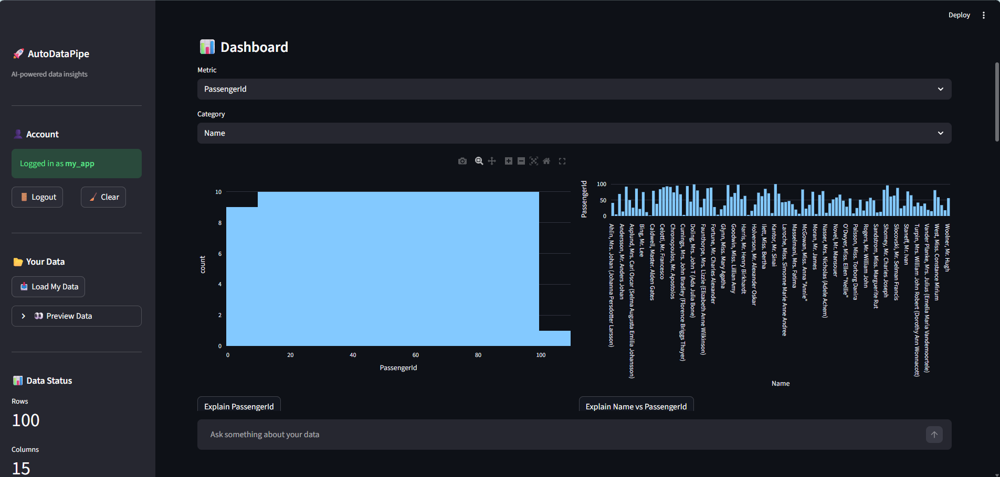
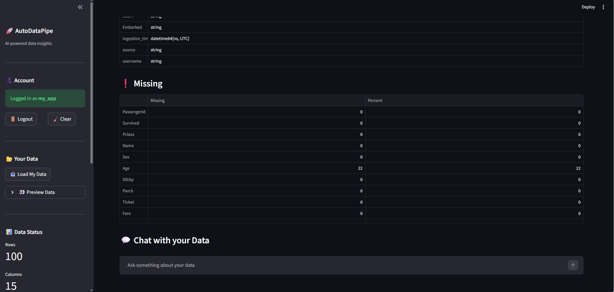
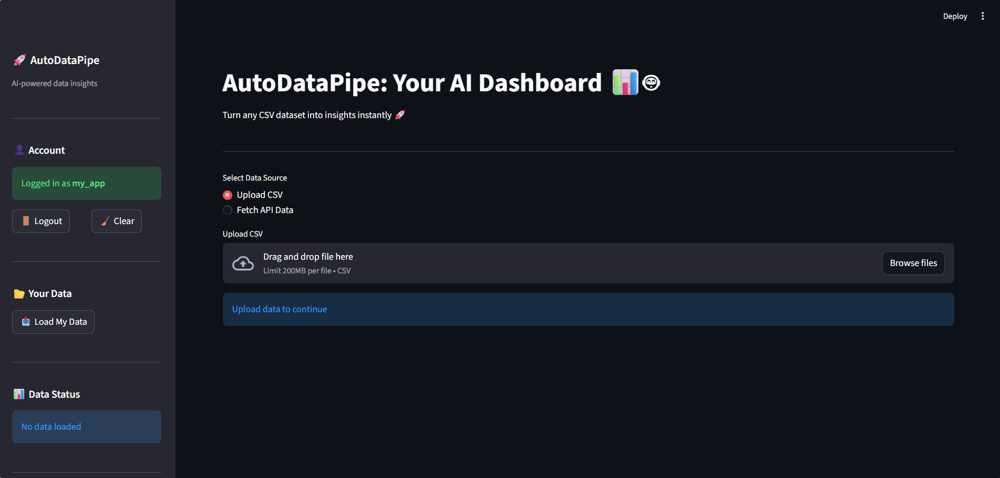
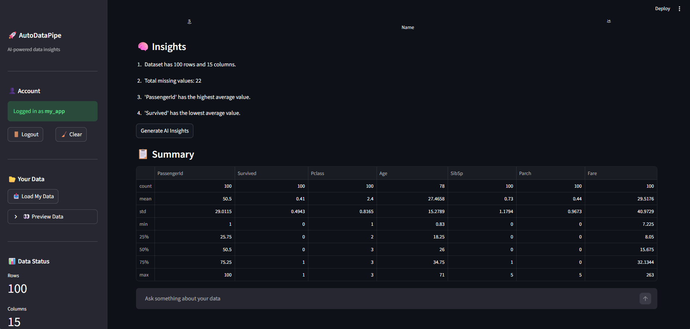
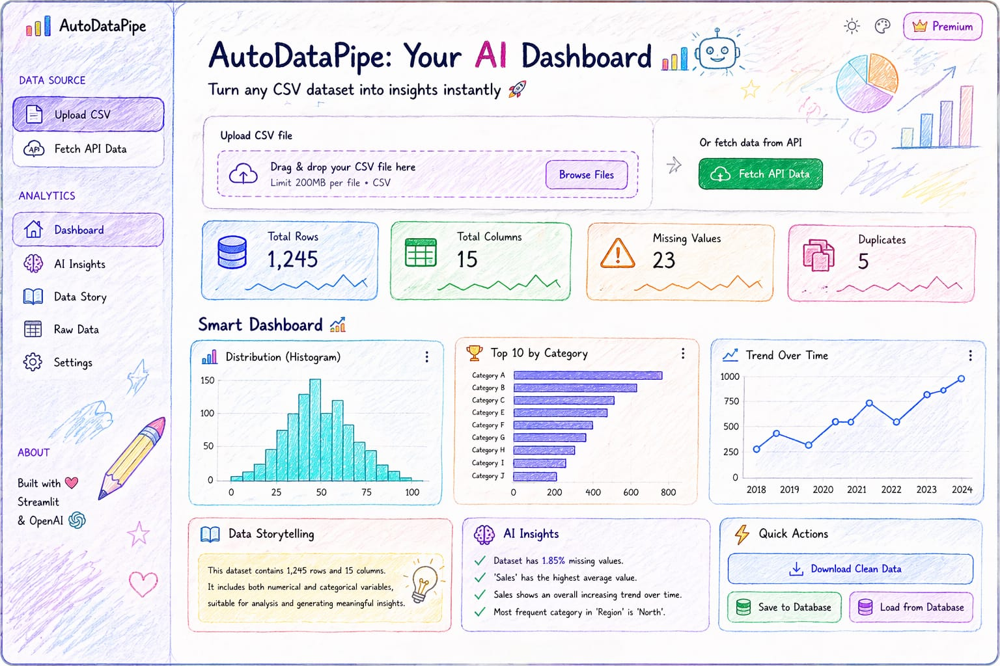

# 🚀 AutoDataPipe: AI-Powered Data Analytics Platform

AutoDataPipe is an end-to-end data analytics system that transforms raw datasets into insights using ETL pipelines, interactive visualizations, and AI-powered querying.

---

## 🎯 Problem Solved

Analyzing data requires:
- Writing SQL queries
- Manual cleaning
- Technical expertise

AutoDataPipe eliminates this by enabling **non-technical users to explore data using natural language.**

---

## 🚀 Key Features

- 📂 Upload CSV or fetch API data
- ⚙️ Automated ETL pipeline (cleaning + transformation)
- 📊 Interactive charts (histogram, bar, scatter, line)
- 🤖 AI-powered insights & chat
- 💬 Context-aware chat (remembers previous questions)
- 🧠 Smart fallback engine (works without API)
- 🔐 User authentication system
- 💾 User-specific dataset storage

---

## 📊 Impact

- Reduced manual data analysis effort by **~80%**
- Enabled instant insights without SQL
- Built full pipeline: ingestion → processing → visualization → AI

---

## 🧠 Tech Stack

**Backend:** Python, Pandas, NumPy  
**Database:** SQLite / PostgreSQL  
**Frontend:** Streamlit  
**Visualization:** Plotly  
**AI:** OpenAI API  

---

## 📸 Current App (Latest)

<p align="center">
  
  
  
  
  
</p>


## 🎨 Future UI (React Concept)



---

👤 Author
Vineet Kumar Mehta
GitHub: https://github.com/Vineetm-dev⁠�

## ⚙️ Run Locally

```bash
git clone https://github.com/Vineetm-dev/autodatapipe.git
cd autodatapipe

pip install -r requirements.txt
streamlit run app.py
