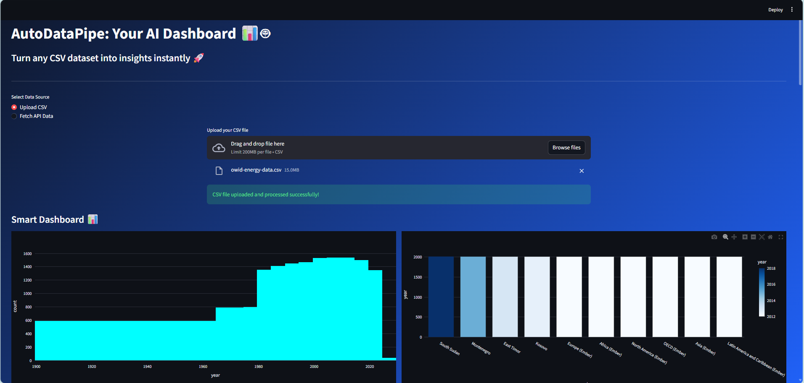
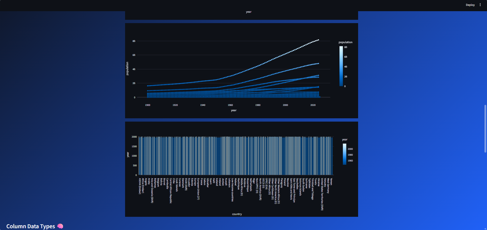
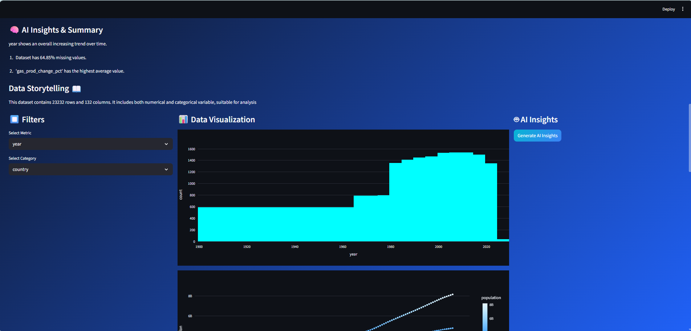
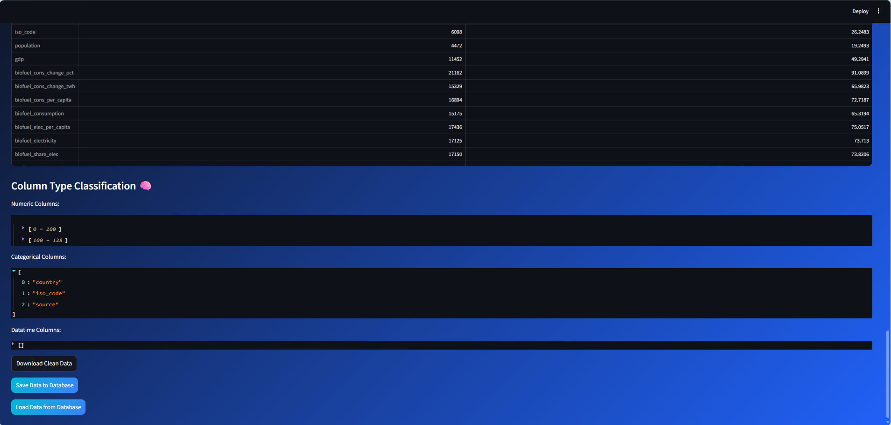

# 🚀 AutoDataPipe  
### AI-Powered Data Analysis & Smart ETL Pipeline Tool
---

## 📸 App Screenshots
### 🌟 Concept / Future UI
<p align="center">
  
</p>

### 🎨 Actual app Dashboard UI
<p align="center">
  
</p>

### 📊 Data Visualization
<p align="center">
  
</p>

### 🤖 AI Insights
<p align="center">
  
</p>

### 🧠 Advanced Analytics
<p align="center">
  
</p>


## 🌟 Overview
AutoDataPipe is an intelligent data analysis platform that automates the entire pipeline — from raw dataset ingestion to visualization and AI-driven insights.

It simulates real-world **ETL (Extract → Transform → Load)** workflows while providing an interactive dashboard for fast exploratory data analysis.

---

## 🚀 Key Features

### 📂 Data Ingestion
- Upload CSV datasets
- Fetch real-time API data (CoinGecko integration)

### 🧹 Data Cleaning & Processing
- Automatic duplicate removal
- Missing value handling
- Data normalization & enrichment
- Metadata tagging (source, ingestion time)

### 🧠 Smart Dataset Intelligence
- Automatic feature detection:
  - Numeric columns
  - Categorical columns
  - Datetime columns
- Time-series detection (year, date, timestamp)
- Country/location detection

### 📊 Interactive Visualizations
- Histogram (distribution analysis)
- Bar charts (category comparison)
- Scatter plots (correlation)
- Time-series charts (trend analysis)
- Dynamic chart selection based on dataset

### 🤖 AI-Powered Insights
- Dataset summary generation
- Key trend detection
- Natural language Q&A on data
- Automated storytelling of dataset

### 🗄 Database Integration
- PostgreSQL support via SQLAlchemy
- Save & reload processed datasets

## 🎯 Key Highlights

- Built an end-to-end data pipeline using Python
- Integrated AI for automated dataset insights
- Designed a modular and scalable architecture
- Combined data engineering, analytics, and interactive UI

## 🔮 Future Improvements

- Auto ML model recommendations
- Dataset quality scoring system
- Exportable PDF reports
- Enhanced UI with React frontend
- Real-time data streaming support

---

## 🧱 Tech Stack

### Core
- Python
- Pandas
- Streamlit
- Plotly

### Backend & Integration
- SQLAlchemy
- PostgreSQL
- Requests (API integration)

### AI Layer
- OpenAI API (GPT-based insights)

---

## ⚙️ System Design Concepts

- ETL Pipeline Simulation
- Data Cleaning & Validation
- Feature Engineering Basics
- Schema Detection
- Interactive Data Visualization
- AI-assisted Analytics

---

## 📊 Use Cases

- Exploratory Data Analysis (EDA)
- Data quality inspection
- Quick dataset profiling
- Dashboard prototyping
- AI-assisted data understanding

---

## 🖥️ How to Run Locally

```bash
git clone https://github.com/Vineetm-dev/autodatapipe.git
cd autodatapipe

pip install -r requirements.txt
streamlit run app.py
